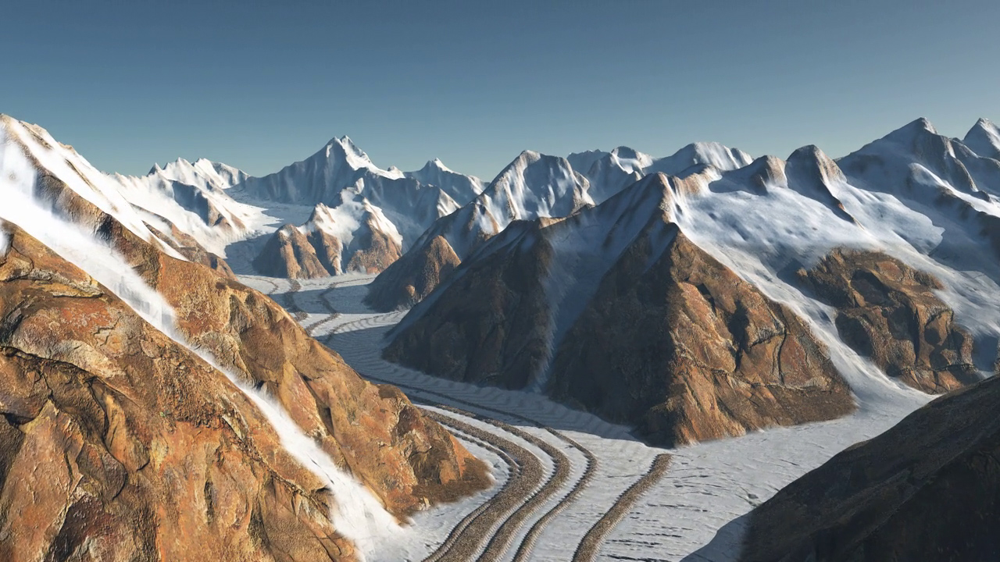

# Simulation, Modeling and Authoring of Glaciers


Interactive simulation of glaciers on a terrain and procedural modeling of several glacier features.


## Repository contents

This repository contains our implementation of the paper, needed data, and examples.

| Directory | Description |
| ---: | :--- |
| **[code](./code)**  | Source code of the two OpenGL applications: simulation and feature placement.  |
| **[data](./data)** | Input terrains, application data, intermediate results and maps. |
| **[img](./img)**  | Teaser image and other beautiful pictures of our glaciers rendered using E-On software's VUE. |
| **[shaders](./shaders)**  | Shaders for rendering and ice simulation. |


## Requirements

We have tested this implementation on a Windows 10 machine equipped with an NVIDIA GeForce GTX 1060.

For the simulation and rendering applications, we used Qt Creator and tested the projects using both the ``MinGW`` and the ``MSVC2019`` kits (64 bit). Importing the .pro files into Visual Studio 2019 with Qt Visual Studio Tools 2.6.0 also created working solutions directly.

C++ libraries:
```
Qt 5.15, OpenGL 4.3, GLEW 2.1.0 
```
You will need to define a ``GLEW_DIR`` environment variable pointing to the location of the headers and library files.

For the features notebook, we used a miniconda Python 3.7 environment installing the following packages:
```
numpy, matplotlib, jupyter, pypng, opencv, scikit-image
```


## Running the code

The workflow consists of three sequential steps.

### 1. Glacier simulation

Compile and run [GlaciersSim.pro](./GlaciersSim.pro).

The ice simulation is executed in an interactive terrain editor using OpenGL and a Compute Shader.

The input is an elevation map, we assume height to be encoded in a 16 bit png as decimeters (0.1m). Additionally, a solar radiance map, a precipitation map or an initial ice layer can also be provided. See [data/terrains](./data/terrains) for examples. We included preset scenes configurations to replicate some of the results shown in the paper.

The core of the glacier simulation implementation is the SIA compute shader [sia.glsl](./shaders/sia.glsl), which is used from the [GlacierTerrain class](./code/glacierterrain.h).


### 2. Feature placement

Run the [GlaciersFeatures.ipynb](/GlaciersFeatures.ipynb) jupyter notebook. It contains all the functions, instructions and comments explaining the main ideas, so you only need to follow it in order.

This notebook will read the elevation map of the bedrock, the simulated ice thickness, and the mask of ice cells above ELA, and output all the necessary extra maps that will later be used to prepare the final rendering. 


### 3. Render

Compile and run [GlaciersRender.pro](./GlaciersRender.pro).

We include a simple Qt OpenGL app that we used to test the feature placement and generate the necessary maps that would be streamed to the offline renders using ``E-On software's VUE``. Note that the goal of this application is to demonstrate the placement, not to be photorealistic.


## Remarks and to-do

The code we provide here is a cleaned version of our research code for demonstration purposes and is provided *as is*. 

The C++ application relied on many classes from the team's internal libraries. We have extracted and refactored the relevant functions for this code release, so don't expect these classes to be fully reusable out of this context, commonly needed functionality might be missing.

It would also be interesting to integrate the features computation into the OpenGL app editor directly. This part was faster to experiment using Python and we haven't ported the final code into the apps.


### Known issues

GlacierSim: brush edits on a map added for demonstration purposes. They do not propagate to other levels of the multiresolution, but this should be easy to fix.


## Article

The article is published in [ACM Transactions on Graphics](https://doi.org/10.1145/3414685.3417855). The authors' version can also be read [here](https://hal.archives-ouvertes.fr/hal-02929531/document).

If you use this code for your research, please cite our paper:
```
@article{Argudo2020glaciers,
    title = {Simulation, Modeling and Authoring of Glaciers},
    author = {Argudo,Oscar and Galin,Eric and Peytavie,Adrien and Paris,Axel and Gu\'{e}rin,Eric},
    journal = {ACM Transactions on Graphics (SIGGRAPH Asia 2020)},
    year = {2020},
    volume = {39},
    number = {6}
}
```


## Acknowledgements

* Alex Jarosch for sharing a Python implementation of their paper "Restoring mass conservation to shallow ice flow models over complex terrain", which was used as a starting point in our experiments. Check out [his repository](https://github.com/alexjarosch/sia-fluxlim) for their code and a link to their paper.

* [Jordi Camins](http://www.gelicehielo.com/) for his advice on modeling the glacier features.

* Jürg Alean and Michael Hambrey from Glaciers online. Their [photoglossary](https://www.swisseduc.ch/glaciers/glossary/index-en.html) was very useful for understanding and modeling the glacier features.
 